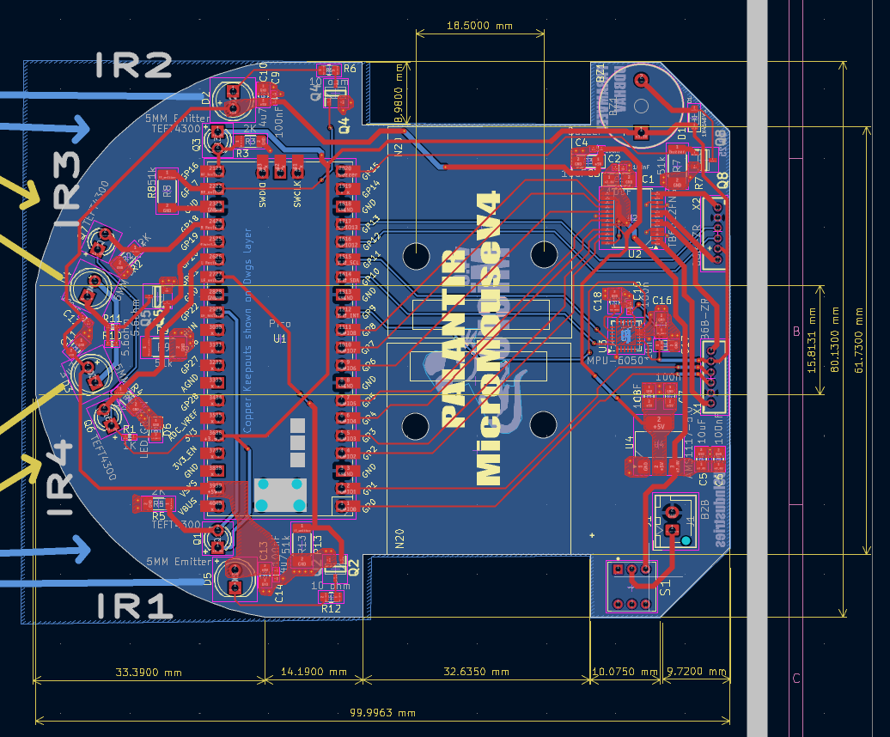
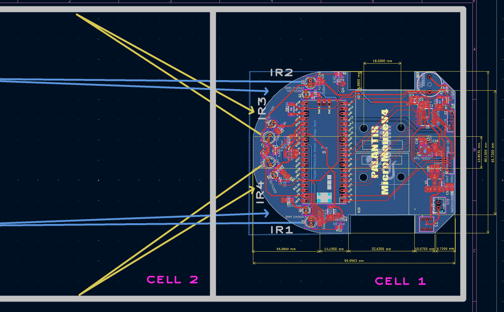
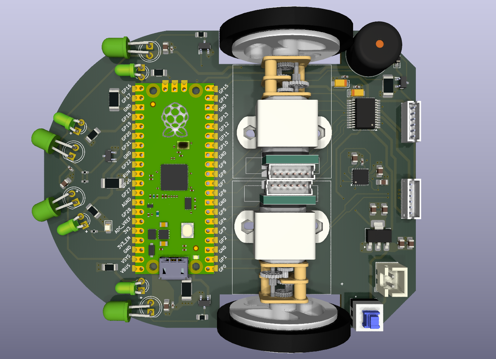

# Hardware — Palantir MicroMouse V4

This document covers the custom PCB design, sensor layout, and mechanical assembly for the micromouse robot.

## PCB Overview

The robot runs on a custom two-layer PCB (**Palantir MicroMouse V4**, designed in KiCad 9.0) measuring **99.9963 mm × 61.7300 mm**. The board is built around a Raspberry Pi Pico, with all GPIO pins broken out along one edge for easy access and debugging.

Key sections on the board:

- **Raspberry Pi Pico footprint** — center-left, with full GPIO breakout (GP0–GP28)
- **IR sensor array** — 4 emitter/receiver pairs (IR1–IR4) along the front-left curve
- **MPU-6050 gyroscope** — right side, for orientation and turn-angle feedback
- **Motor driver section** — right side, driving the dual DC gear-motors
- **Power regulation** — AMS1117 linear regulator with a JST battery connector (bottom right)

## IR Sensor Placement & Sensing Geometry

Sensor placement isn't arbitrary — each IR pair is angled to cover a specific part of the maze cell grid ahead of and beside the robot.

- **IR1 / IR4** (bottom pair) — near-field detection of the front and immediate side walls
- **IR2 / IR3** (top pair) — angled diagonally across the *next* cell, giving early detection of upcoming walls before the robot fully enters a cell

This layout lets the robot start planning its next move before it's even finished crossing the current cell.

## Mechanical Assembly

The 3D render below shows the complete assembly: dual DC gear-motors with encoders mounted symmetrically (top/bottom), the Pico module and IR emitters on the left, and the motor driver, buzzer, and push-button on the right.

## Design Files

- `PCB/mm3.0/` — KiCad project (schematic, board file, project libraries)
- `PCB/manufacturing/` — Gerbers, BOM, and pick-and-place files for fabrication

## Bill of Materials (summary)

| Component | Notes |
|---|---|
| Raspberry Pi Pico | Main microcontroller |
| MPU-6050 | Gyroscope for orientation/turns |
| 4x IR emitter/receiver (TEFT4300 + emitter) | Wall detection |
| AMS1117 | 3.3V/5V regulation |
| 2x DC gear-motor w/ encoder | Drive |
| Motor driver IC | Dual motor control |
| JST battery connector | Power input |

## Author
Udbhav Singh 
